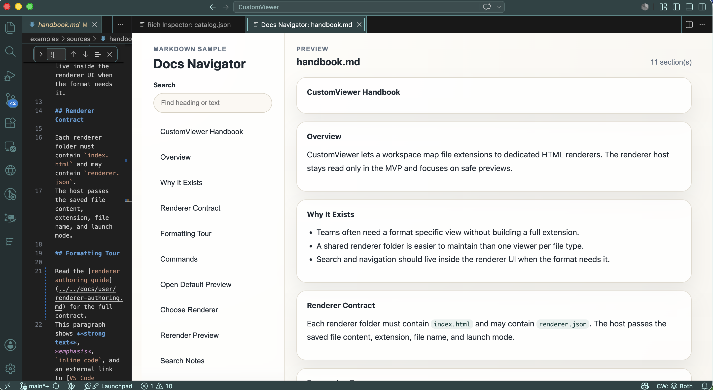
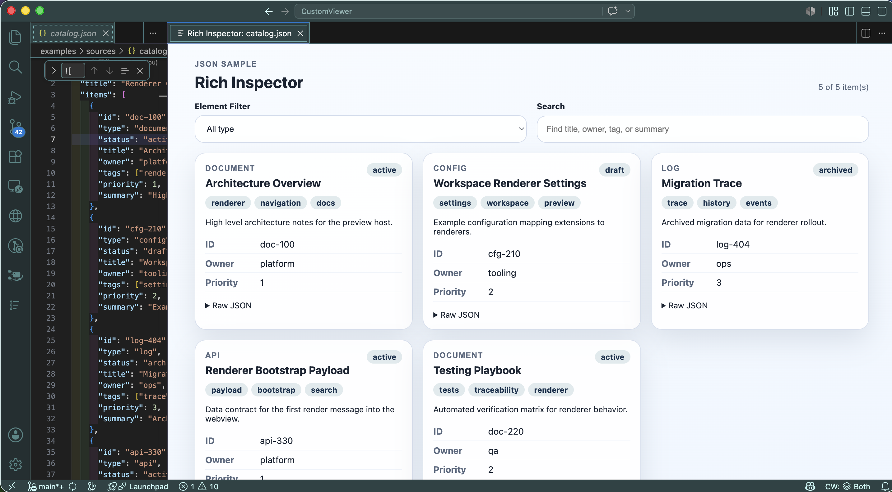
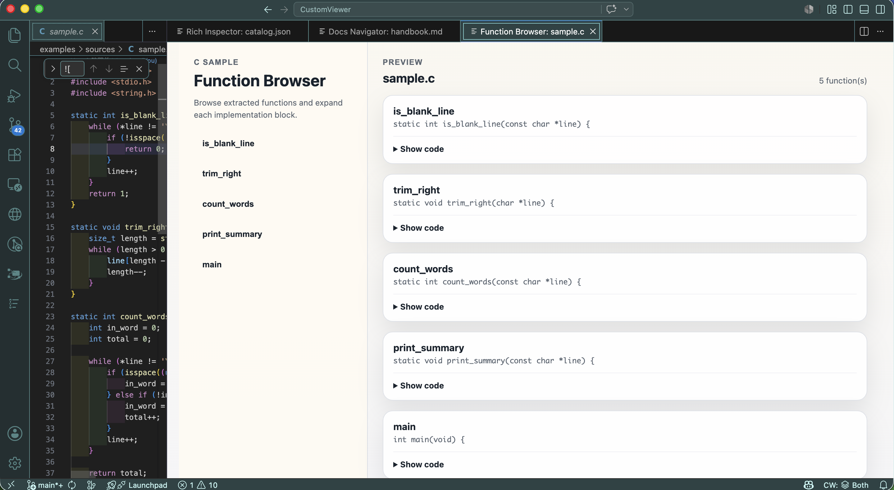
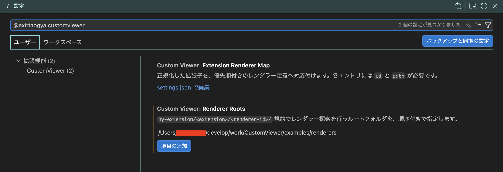
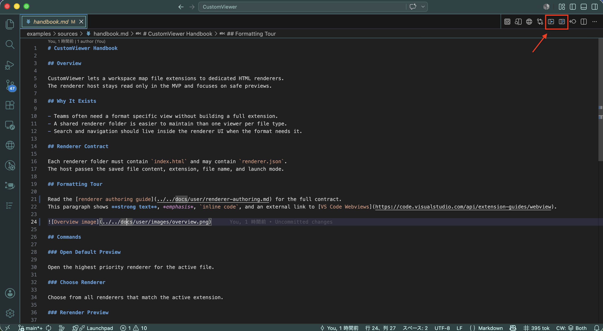

# CustomViewer

[日本語版 README](./README.ja.md)

**Preview any text file in VS Code with your own HTML page.**

CustomViewer opens a preview panel next to your editor and renders the file using an HTML page (a "renderer") that you choose per file extension. Markdown, JSON, CSV, log files, your own DSL — if you can write HTML/CSS/JS, you can build a preview for it.

**Markdown**


**Json**


**C Lang**


## Why use it

- **Bring your own preview.** Point an extension like `.md` or `.json` at any folder that contains an `index.html`.
- **Read-only and predictable.** Only the *saved* file content is sent to the preview. Nothing runs until you ask.
- **Safe by default.** The preview runs in a strict sandbox with no network access and no VS Code APIs.

## Try it in 30 seconds

1. Install CustomViewer (see [Install](#install) below).
2. Open this repository in VS Code.
3. Copy [examples/settings/workspace.settings.jsonc](./examples/settings/workspace.settings.jsonc) into your workspace settings.  
  In the following example, only `customViewer.rendererRoots` is set.  
  
4. Open [examples/sources/handbook.md](./examples/sources/handbook.md).
5. Press `Cmd+Alt+V` (macOS) or `Ctrl+Alt+V` (Windows/Linux) or Click Rendering Icon.
  

A second tab opens beside the editor and shows the Markdown rendered by the included **Docs Navigator** sample.

The repo also ships sample previews for `.json` and `.c` — see [examples/README.md](./examples/README.md).

## Commands

| Command | Shortcut | What it does |
| --- | --- | --- |
| CustomViewer: Open Default Preview | `Cmd/Ctrl+Alt+V` | Opens the preview for the active file. |
| CustomViewer: Choose Renderer Preview | – | Pick from multiple previews when more than one is configured for the extension. |
| CustomViewer: Open Renderer Standalone | – | Open a renderer without any source file. |
| CustomViewer: Rerender Preview | `Cmd/Ctrl+Alt+R` | Re-read the saved file and refresh the preview. |
| CustomViewer: Open Settings | – | Open VS Code Settings filtered to CustomViewer. |

> CustomViewer never refreshes automatically. Save your file, then run Rerender.

## Use your own preview

In your VS Code settings, point an extension at a folder containing `index.html`:

```jsonc
{
  "customViewer.extensionRendererMap": {
    "md": [
      {
        "id": "my-md",
        "displayName": "My Markdown Preview",
        "path": "${workspaceFolder}/my-renderer"
      }
    ]
  }
}
```

Paths must be **absolute** or start with `${workspaceFolder}`. That's it — open a `.md` file and press `Cmd/Ctrl+Alt+V`.

Want the settings UI directly? Run **CustomViewer: Open Settings** from the Command Palette.

More details: see [User Guide](./docs/user/getting-started.md).

## Install

In VS Code:

1. Open the Extensions view (`Cmd+Shift+X` / `Ctrl+Shift+X`).
2. Search for **CustomViewer** and click **Install**.

Or install from the command line:

```sh
code --install-extension taogya.customviewer
```

## Documentation

- [Getting Started](./docs/user/getting-started.md) — install, configure, open your first preview
- [Configuration](./docs/user/configuration.md) — settings reference and security notes
- [Build Your Own Renderer](./docs/user/renderer-authoring.md) — write a custom HTML preview
- [AI Prompt for Renderers](./docs/user/ai-prompt.md) — ready-to-use prompt to have an AI assistant build a renderer for you
- [Troubleshooting](./docs/user/troubleshooting.md) — when things don't work

## Current limitations

CustomViewer is a preview host. What you can do depends partly on the renderer you chose.

- The preview is read-only. You still edit the original file in the text editor.
- Only saved content is sent to the preview. After editing, save the file and run **Rerender Preview**.
- The included Markdown sample renderer can navigate source-relative document links inside the same preview when the current renderer can handle the target text file. Other targets fall back to the editor. It is still a sample renderer rather than a full Markdown editor/viewer.
- Restricted Mode is VS Code's safety mode for folders you do not trust yet. In that mode, renderers stored inside the workspace are blocked.
- If this is your own day-to-day project, you will usually want to trust the workspace. If you are only inspecting an unfamiliar repository, Restricted Mode is the safer default.

## License

BSD 3-Clause. See [LICENSE](./LICENSE).

---

## For contributors

Building, packaging, and project specifications live alongside the code:

- Build a local VSIX: `npm install` then `npm run package:vsix`
- Run tests: `npm test`
- [Product requirements](./docs/README.md) and [basic design](./docs/DESIGN.md)
- [Changelog](./CHANGELOG.md)
