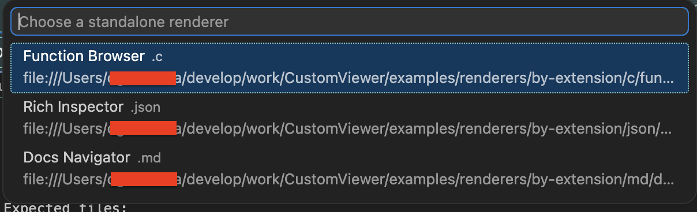

# Configuration

[日本語](./ja/configuration.md) · [Back to README](../../README.md)

CustomViewer exposes two settings. Most users only need the first one.

To jump here directly inside VS Code, run **CustomViewer: Open Settings** from the Command Palette.

## `customViewer.extensionRendererMap`

Map a file extension to one or more preview folders. Each folder must contain an `index.html`.

```jsonc
{
  "customViewer.extensionRendererMap": {
    "md": [
      {
        "id": "docs-navigator",
        "displayName": "Docs Navigator",
        "path": "${workspaceFolder}/renderers/md/docs-navigator"
      }
    ],
    "json": [
      { "id": "rich-inspector", "path": "/Users/me/renderers/rich-inspector" },
      { "id": "json-raw",       "path": "/Users/me/renderers/json-raw" }
    ]
  }
}
```

- The **first entry wins** when you press `Cmd/Ctrl+Alt+V`.
- All entries appear in the picker when you run "CustomViewer: Choose Renderer Preview".
- `id` is a stable name you choose. `displayName` is what users see in the picker.



## `customViewer.rendererRoots` (optional)

If you keep many previews in one place, point CustomViewer at a parent folder. It will scan for previews using this layout:

```text
<root>/by-extension/<extension>/<renderer-id>/index.html
```

```jsonc
{
  "customViewer.rendererRoots": [
    "${workspaceFolder}/renderers",
    "/Users/me/shared-renderers"
  ]
}
```

Roots are scanned **after** `extensionRendererMap`. Use whichever style fits your project; you can mix both.

## Path rules

Paths in both settings must be:

- an absolute path (`/Users/me/...`, `C:\...`), **or**
- `${workspaceFolder}/...`, **or**
- `${workspaceFolder:<name>}/...` (for multi-root workspaces).

Plain relative paths (`./renderers/md`) are rejected.

In remote workspaces (SSH, Dev Containers, WSL, Codespaces), the preview folder must live on the **same side** as the VS Code extension host — usually the remote side.

## Security: Workspace Trust

CustomViewer runs HTML/CSS/JS that you point it at, so it respects [VS Code Workspace Trust](https://code.visualstudio.com/docs/editor/workspace-trust).

Think of Restricted Mode as "open first, trust later." It is most useful when you want to inspect an unfamiliar repository without immediately letting its workspace-provided preview code run.

| Workspace mode | What CustomViewer does |
| --- | --- |
| **Trusted** | All settings and preview folders work, including ones inside the workspace. |
| **Restricted Mode** | Workspace-level settings are ignored. Preview folders located **inside** the workspace are blocked. Preview folders defined in your **user** settings and located **outside** the workspace still work. |

If this is your own project and you expect its renderers to work, trust the workspace. If you only want to inspect a third-party repository safely, keep it restricted.

If you want previews to work in any workspace without trusting it, keep them outside the workspace and configure them in your **user** settings.

## Tips

- **Per-project previews**: workspace settings + `${workspaceFolder}` paths.
- **Personal previews used in every project**: user settings + absolute paths.
- **Mixed**: pick a default in `extensionRendererMap`, keep the rest under `rendererRoots`.

## See also

- [Getting Started](./getting-started.md)
- [Build Your Own Renderer](./renderer-authoring.md)
- [Troubleshooting](./troubleshooting.md)
